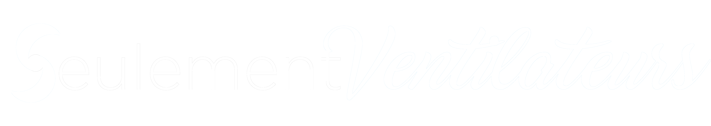

A completely original and innovative social media !

<h2 style="color: #45AFFF">Install and setup</h2>
To become a VentiloFan, you will need to setup your local environement.
And, to do so, you will need to setup a database and host locally your own version of Seulement Ventilateurs.

For the database management, we recommand using [Laragon](https://laragon.org/) as we used it to build this project.

<h3 style="color: #45AFFF">Setting up Laragon</h3>
(TUTO LARAGON)

In order to host the site locally, we recommand using [PhpStorm](https://www.jetbrains.com/phpstorm/) as we also used
this IDE to program the all the code available on this repository. You will then be able to do your own modifications
on the site and inspect what we did and how.

<h3 style="color: #45AFFF">Setting up PhpStorm</h3>
(TUTO PHPSTORM)

<h2 style="color: #45AFFF">Features</h2>
Seulement Ventilateurs is a social media where you can share content related to ventilators and interact with other
VentiloFans.